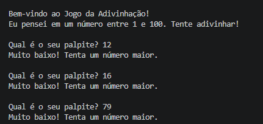

# Jogo da Adivinhação em Python

Um joguinho simples e divertido: o computador pensa em um número secreto entre 1 e 100, e você tenta adivinhar com dicas de "muito alto" ou "muito baixo"!

<p align="center">
  
</p>

## Como jogar

1. Certifique-se de ter Python instalado (versão 3.6 ou superior).

2. Clone o repositório:
   ```bash
   git clone https://github.com/massucattokauan-oss/jogo-adivinhacao.git
   cd jogo-adivinhacao
